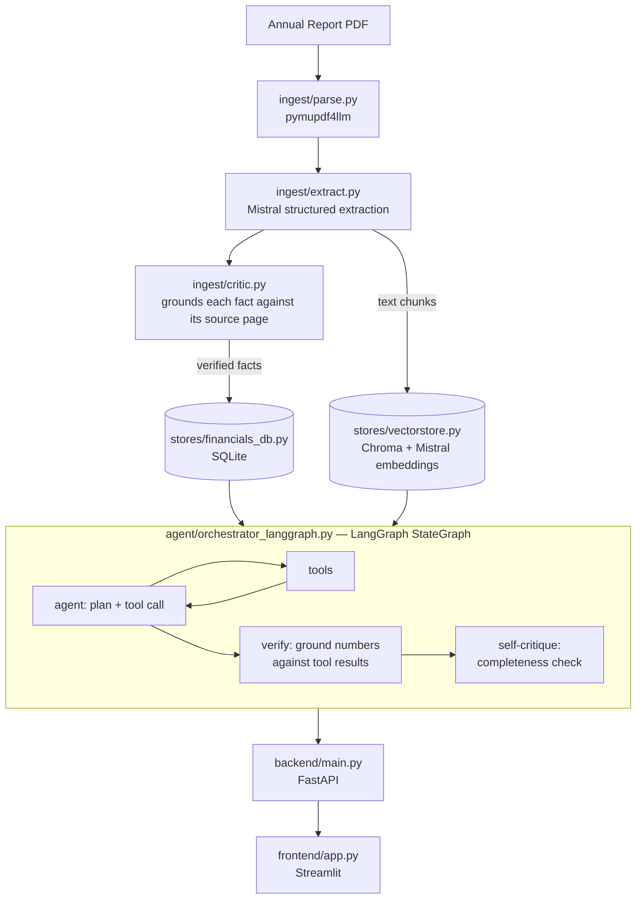

# Financial Document Analyst

[](https://github.com/Ankita1-a/Company_Financial_Annual_Report_Analysis_Agent/actions/workflows/ci.yml)

An agentic system built to read companies' annual reports and actually
answer questions about them — real financial trends, qualitative risk
factors, and information beyond the reports entirely — grounded, checked,
and self-critiqued before the answer is ever returned. It was built end
to end on free-tier APIs, containerized, and shipped with its own CI/CD
pipeline.

```
"What's Tata Steel's revenue CAGR from FY2021 to FY2024, and how does
 that compare to L&T over the same period?"

 -> resolves the company names, pulls the real trend data, computes CAGR
    with plain arithmetic (not LLM math), compares both, cites the exact
    source page, and double-checks its own answer before returning it.
```

This README covers the whole thing — the environment being set up, real
PDFs being ingested, the agent running locally, and it being containerized.
The architecture section below has the technical overview; "Getting
started" walks through the full setup in order.

---

## What it does

- Structured financial lookups — exact figures, YoY growth, and CAGR, computed with real arithmetic
- Semantic search over qualitative report text, a sandboxed code-execution tool, and free web search for anything beyond the ingested reports
- Visible planning, answer verification, and self-critique on every response

## Architecture



Extraction and retrieval were deliberately kept as separate concerns.
Standard metrics (revenue, capex, margins) become structured database rows
with real computed trends — not a retrieval gamble. Only qualitative text
goes through vector search, where it actually belongs. And an explicit
verification step was built into the graph's structure, rather than just
hoping the model remembers to check its own work.

---

## Getting started

Everything below assumes the working directory is the project root, and
that **port 8000** is free for the backend.

### 1. Setting up the environment

```bash
conda create -n financial-analyst python=3.12 -y
conda activate financial-analyst
pip install -r requirements.txt
```

The root `requirements.txt` covers everything — ingestion, the agent, and
both services. `backend/requirements.txt` and `frontend/requirements.txt`
are separate, intentionally minimal subsets used only for the Docker
builds later on; those aren't touched directly here.

### 2. Setting up the Mistral key

Free at **console.mistral.ai**.

```bash
export MISTRAL_API_KEY=<mistral-api-key>
curl https://api.mistral.ai/v1/models -H "Authorization: Bearer $MISTRAL_API_KEY"
```

That `curl` bypasses the whole project and talks to Mistral directly — if
it doesn't return a real list of models, nothing downstream will work
either, so it's worth confirming here before going any further.

### 3. Adding reports

PDFs are placed under `data/raw_pdfs/`, and `manifest.json` is updated to
point at them:

```json
[
  {"pdf_path": "data/raw_pdfs/TATASTEEL/2026/tatasteel-iar-2025-26.pdf", "company": "Tata Steel", "fiscal_year": 2025},
  {"pdf_path": "data/raw_pdfs/LT/2026/LT_FY2026.pdf", "company": "L&T", "fiscal_year": 2025}
]
```

### 4. Build the index

This is the one genuinely expensive step — real Mistral calls for
structured extraction, so it costs real usage and takes real minutes for
a large report.

```bash
python -m ingest.build_index manifest.json data/financials.sqlite data/chroma_db
```

It's safe to re-run this later if a report is added or one is re-ingested
— facts get upserted and that company/year's chunks get replaced, not
duplicated. Parsing is cached; extraction isn't, so a re-run still spends
fresh API calls on that part specifically.

Quick sanity check that it actually worked:
```bash
python3 -c "from stores.financials_db import list_companies; print(list_companies('data/financials.sqlite'))"
```

### 5. Run the smoke tests

Every module carries its own offline test suite — mocked LLM calls, real
logic, no network — so this is the fastest way to confirm the code itself
is correct before Docker or a live server enter the picture at all:

```bash
python3 stores/financials_db.py
python3 stores/vectorstore.py
python3 agent/verifier.py
python3 agent/tools.py
python3 agent/orchestrator_langgraph.py
python3 ingest/extract.py
python3 ingest/build_index.py
```

Each one should end with a line like `All X smoke tests passed`.

### 6. Run it locally, backend and frontend

**Terminal 1:**
```bash
python3 -m uvicorn backend.main:app --reload --port 8000
```

**Terminal 2**, once the backend's up:
```bash
export BACKEND_URL=http://localhost:8000
export MISTRAL_API_KEY=<mistral-api-key>
streamlit run frontend/app.py
```

The printed URL is opened, the sidebar shows the real ingested companies,
and a real question is asked.

### 7. Put it in containers

```bash
docker build -f backend/Dockerfile -t financial-analyst-backend .
docker build -f frontend/Dockerfile -t financial-analyst-frontend .
```

> On a Mac, `open Dockerfile: no such file or directory` despite the file
> clearly being there almost always means one thing: macOS's filesystem is
> case-insensitive, but Docker's build engine isn't. A file saved as
> `DockerFile` instead of `Dockerfile` looks identical in Finder but won't
> be found by the build.

They're run individually first, to keep a Dockerfile problem separate
from a networking problem:
```bash
docker run --rm -p 8000:8000 -e MISTRAL_API_KEY=$MISTRAL_API_KEY financial-analyst-backend
```

Then the whole thing is brought up together:
```bash
docker compose up --build
```
`docker compose ps` should show the backend as `healthy` before the
frontend starts. **http://localhost:8501** is opened, and a real
conversation is run through.
