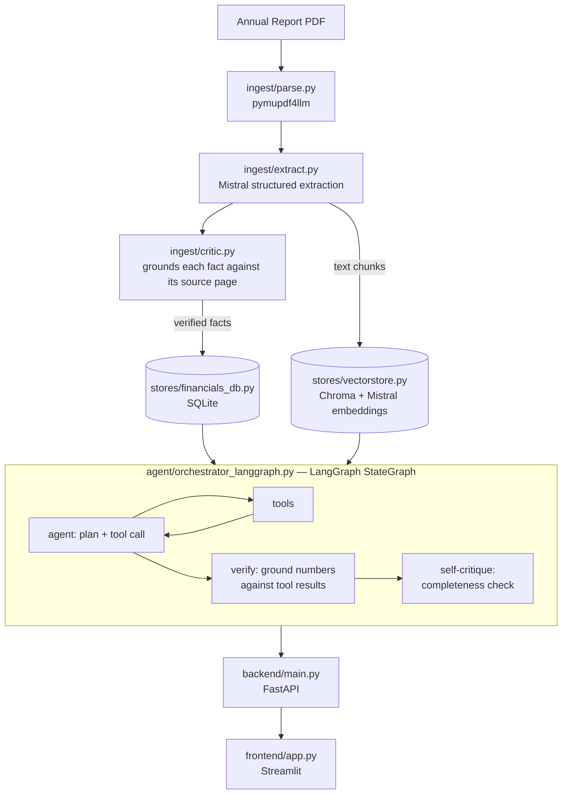

# Financial Document Analyst

[](https://github.com/Ankita1-a/Company_Financial_Annual_Report_Analysis_Agent/actions/workflows/ci.yml)

An agentic system that reads companies' annual reports and actually
answers questions about them — real financial trends, qualitative risk
factors, and information beyond the reports entirely — grounded, checked,
and self-critiqued before you ever see the answer. Built end to end on
free-tier APIs, containerized, and shipped with its own CI/CD pipeline.

```
"What's Tata Steel's revenue CAGR from FY2021 to FY2024, and how does
 that compare to L&T over the same period?"

 -> resolves the company names, pulls the real trend data, computes CAGR
    with plain arithmetic (not LLM math), compares both, cites the exact
    source page, and double-checks its own answer before returning it.
```

This README walks through the whole thing — setting up your environment,
ingesting real PDFs, running the agent locally, containerizing it, and
watching it get tested and published automatically on every push. If
you're just here to skim the architecture, jump to that section below;
if you're setting this up on your own machine, start at "Getting started"
and just follow along in order.

---

## What it actually does

- **Structured financial lookups** — exact figures, YoY growth, CAGR, computed with real arithmetic, not language-model math
- **Qualitative search** — semantic search over risk factors, MD&A, and segment commentary
- **Code execution** — a sandboxed tool for custom calculations the fixed tools don't cover, with access to everything already fetched earlier in the conversation
- **Web search** — free, no-API-key search for anything genuinely outside the ingested reports
- **Visible planning** — the agent states its plan before acting, instead of hiding its reasoning inside a black box
- **Answer verification** — every number in the final answer is checked against the tool results that produced it
- **Self-critique** — a second pass checks whether the answer actually addressed everything that was asked

## A few real bugs found along the way

Most of what makes this project worth looking at isn't the feature list —
it's what got found and fixed while actually using it, not just planning
it on paper.

| Found | What was really going on | Fix |
|---|---|---|
| A correct number rendered as a garbled figure in the final answer | The LLM transcribed a correct retrieved figure incorrectly in prose | A verifier that grounds every number in the answer against the turn's actual tool results |
| A real citation URL got flagged as an "unmatched" 123-billion figure | The number-extraction regex didn't know to ignore digits inside URLs | Strip URLs before number extraction, with a regression test built from the real failure |
| Every number from a web search result was flagged as unmatched | The verifier only read numeric fields, and search snippets are free text | Extended it to read numbers embedded in string fields too |
| `vector_search` failing with a dimension-mismatch error | A stale test chunk had permanently locked the vector collection's dimension | A full collection reset — deleting *documents* alone doesn't undo that lock |
| A CI pipeline that built fine locally failed on GitHub with an invalid image tag | Docker image names must be lowercase; the real repo name wasn't | Lowercase the repo name at workflow runtime before using it in a tag |

## Architecture



Extraction and retrieval are deliberately separate concerns. Standard
metrics (revenue, capex, margins) become structured database rows with
real computed trends — not a retrieval gamble. Only qualitative text goes
through vector search, where it actually belongs. And the graph has an
explicit verification step baked into its structure, not just a hope that
the model remembers to check its own work.

---

## Getting started

Everything below assumes you're in the project root, and that **port
8000** is free on your machine for the backend.

### 1. Create your environment

```bash
conda create -n financial-analyst python=3.12 -y
conda activate financial-analyst
pip install -r requirements.txt
```

The root `requirements.txt` covers everything — ingestion, the agent, and
both services. `backend/requirements.txt` and `frontend/requirements.txt`
are separate, intentionally minimal subsets used only for the Docker
builds later on; you won't need to touch those directly here.

### 2. Get your Mistral key in place

Free at **console.mistral.ai**.

```bash
export MISTRAL_API_KEY=your-key-here
curl https://api.mistral.ai/v1/models -H "Authorization: Bearer $MISTRAL_API_KEY"
```

That `curl` bypasses the whole project and talks to Mistral directly — if
it doesn't return a real list of models, nothing downstream will work
either, so it's worth confirming here before going any further.

### 3. Bring your own reports in

Drop your PDFs under `data/raw_pdfs/`, then tell `manifest.json` where to
find them:

```json
[
  {"pdf_path": "data/raw_pdfs/TATASTEEL/2026/tatasteel-iar-2025-26.pdf", "company": "Tata Steel", "fiscal_year": 2025},
  {"pdf_path": "data/raw_pdfs/LT/2026/LT_FY2026.pdf", "company": "L&T", "fiscal_year": 2025}
]
```

### 4. Build the index

This is the one genuinely expensive step — real Mistral calls for
structured extraction, so it costs real usage and takes real minutes for
a large report.

```bash
python -m ingest.build_index manifest.json data/financials.sqlite data/chroma_db
```

It's safe to re-run this later if you add a report or re-ingest one —
facts get upserted and that company/year's chunks get replaced, not
duplicated. Parsing is cached; extraction isn't, so a re-run still spends
fresh API calls on that part specifically.

Quick sanity check that it actually worked:
```bash
python3 -c "from stores.financials_db import list_companies; print(list_companies('data/financials.sqlite'))"
```

### 5. Run the smoke tests

Every module carries its own offline test suite — mocked LLM calls, real
logic, no network — so this is the fastest way to confirm the code itself
is correct before Docker or a live server enter the picture at all:

```bash
python3 stores/financials_db.py
python3 stores/vectorstore.py
python3 agent/verifier.py
python3 agent/tools.py
python3 agent/orchestrator_langgraph.py
python3 ingest/extract.py
python3 ingest/build_index.py
```

Each one should end with a line like `All X smoke tests passed`.

### 6. Run it locally, backend and frontend

**Terminal 1:**
```bash
python3 -m uvicorn backend.main:app --reload --port 8000
```

**Terminal 2**, once the backend's up:
```bash
export BACKEND_URL=http://localhost:8000
export MISTRAL_API_KEY=your-key-here
streamlit run frontend/app.py
```

Open the printed URL, check the sidebar shows your real ingested
companies, and ask it something real.

### 7. Put it in containers

```bash
docker build -f backend/Dockerfile -t financial-analyst-backend .
docker build -f frontend/Dockerfile -t financial-analyst-frontend .
```

> If you're on a Mac and hit `open Dockerfile: no such file or directory`
> despite the file clearly being there — macOS's filesystem is
> case-insensitive, but Docker's build engine isn't. A file saved as
> `DockerFile` instead of `Dockerfile` looks identical in Finder but
> won't be found by the build.

Run them individually first, to keep a Dockerfile problem separate from a
networking problem:
```bash
docker run --rm -p 8000:8000 -e MISTRAL_API_KEY=$MISTRAL_API_KEY financial-analyst-backend
```

Then bring the whole thing up together:
```bash
docker compose up --build
```
`docker compose ps` should show the backend as `healthy` before the
frontend even starts. Open **http://localhost:8501** and run through a
real conversation.
